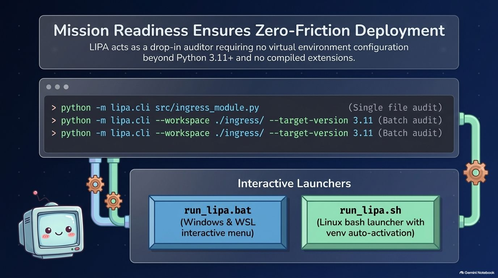
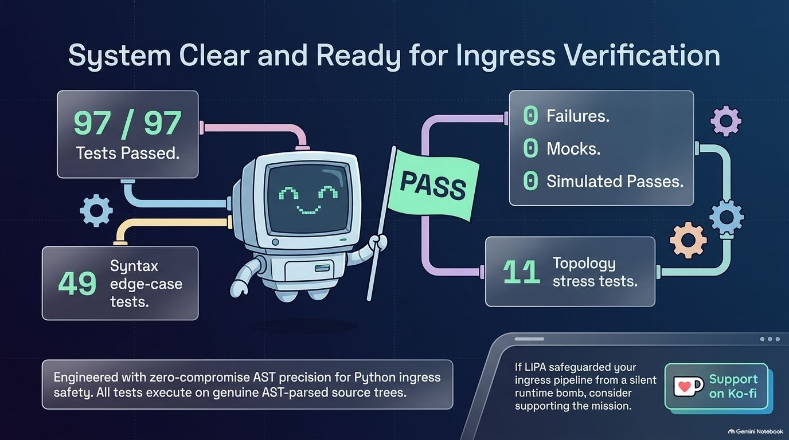

<div align="center">

# ⚡ LIPA (Local Ingress Pre-flight Auditor)
### Zero-Execution AST Safety Gate for Python Ingress Code

</div>


<div align="center">

**Zero-Execution Audit · 4-Stage AST Pipeline · PEP-Gated Syntax · Contract Diffing · Windows + Linux + WSL**

---

[](https://github.com/xTanTHaix/iTan-LIPA/actions/workflows/ci.yml)
[](https://www.python.org/)
[](#-verification--empirical-metrics)
[](#-quick-start--installation)
[](#-architecture-overview)
[](LICENSE)
[](https://ko-fi.com/xtanthaix)

<br>

[**License**](LICENSE) · [**Ko-fi**](https://ko-fi.com/xtanthaix)

</div>

---

> [!IMPORTANT]
> **Zero-Execution Guarantee:** LIPA audits Python ingress code exclusively at the AST level — no file is ever imported, no `exec()` or `eval()` is ever issued. Every safety verdict is derived purely from parsing source files into syntax trees before a single bytecode instruction executes.

---

## ⚠️ The Problem & ⚡ The Solution

| ⚠️ Merging External Python Code is a Silent Runtime Threat | ⚡ The Co-Pilot Paradigm Ensures Zero-Execution Safety |
| :---: | :---: |
|  |  |
| *Silent execution, invisible import cycles, broken API contracts, and version-incompatible syntax — four threat vectors that slip through standard code review undetected.* | *LIPA audits incoming code exclusively at the AST level via a 4-stage diagnostic pipeline. The payload is neutralized by parsing source files directly into syntax trees, evaluating safety without executing a single bytecode instruction.* |

<details>
<summary><b>📖 Why does this matter? — Design Philosophy</b></summary>

<br>

Modern Python projects routinely ingest external code — third-party packages, generated scaffolding, contributed modules, and auto-patched files. Each ingestion point is an attack surface:

- A `requirements.txt` update may introduce a dependency that **shadows a stdlib module**.
- A vendor drop may silently **remove a public symbol** that downstream code depends on.
- A templated file may embed **eval/exec/pickle** calls or **subprocess with `shell=True`**.
- A Python version bump may activate **PEP 594 removals** or **PEP 765 finally-rule violations**.

LIPA intercepts these hazards at the boundary — before merging, before deploying, and before the interpreter ever runs the file.

| Principle | Implementation |
|---|---|
| **Zero runtime deps** | `stdlib` only — `ast`, `pathlib`, `hashlib`, `json`, `sys` |
| **Deterministic** | BLAKE2b fingerprint cache; identical inputs produce identical verdicts |
| **Composable** | JSON output mode pipes into CI scripts, dashboards, and notification hooks |
| **Staged** | Three independent scanning stages executed sequentially |
| **Auditable** | Telemetry JSONL log captures every run for compliance and trend analysis |

</details>

---

## 🏛️ Architecture Overview

<details>
<summary><b>📐 Click to expand: 4-Stage Diagnostic Pipeline</b></summary>

<br>


```
┌─────────────────────────────────────────────────────────────┐
│                INGRESS FILE  (Python source)                 │
└──────────────────────────┬──────────────────────────────────┘
                           │
         ┌─────────────────▼─────────────────┐
         │  Stage 1: ImportBoundaryScanner   │  circular imports · stdlib boundary
         └─────────────────┬─────────────────┘
                           │
         ┌─────────────────▼─────────────────┐
         │  Stage 2: SignatureExtractor      │  contract diff · symbol changes
         └─────────────────┬─────────────────┘
                           │
         ┌─────────────────▼─────────────────┐
         │  Stage 3: SyntaxVersionAuditor    │  17 PEP edge cases · version gating
         └─────────────────┬─────────────────┘
                           │
         ┌─────────────────▼─────────────────┐
         │  Stage 4: FSM Verdict Collapse    │  ✔ PASS · ⚠ WARN · ✖ BLOCKED
         └───────────────────────────────────┘
```

</details>

---

## 🔍 Stage Deep-Dive

| 🔗 Topology & Contract Isolation | 🕐 PEP Time-Gate for Deployment Compatibility |
| :---: | :---: |
|  |  |
| *Stage 1 detects direct circular imports and maps transitive 3+ hop dependency chains. Stage 2 diffs public API contracts against stored baselines, emitting BLOCKED verdicts on symbol removal or signature mutation.* | *The SyntaxVersionAuditor calibrates to the `--target-version` flag and enforces 17 PEP-gated edge cases — blocking generic aliases, match/case, except* groups, and type aliases on incompatible runtimes.* |

---

## 🎯 FSM Verdicts & Comparison Matrix

| 🖥️ FSM Verdict Collapse — Deterministic Outputs | 📊 System Superiority Across the Diagnostic Landscape |
| :---: | :---: |
|  |  |
| *A Finite-State Machine aggregates all pipeline findings into a single, machine-readable verdict with standard exit codes (0=PASS · 1=BLOCKED · 2=WARN) and a full `--json` output mode for CI integration.* | *LIPA is the only zero-dependency, stdlib-only pipeline combining graph-based circular import analysis, contract signature diffing, and PEP-gated version auditing simultaneously.* |

---

## 📊 Feature Comparison Matrix

> [!NOTE]
> LIPA is the only tool in this space combining import topology analysis, contract diffing, and version-gated PEP enforcement into a single zero-dependency stdlib pipeline.

| Capability | `LIPA` | Manual Review | `flake8` / `ruff` | `mypy` |
| :--- | :---: | :---: | :---: | :---: |
| **Zero Runtime Execution** | ✅ AST-only | ❌ Imports run | ✅ AST | ✅ AST |
| **Circular Import Graph Detection** | ✅ Tarjan SCC | ❌ Manual | ❌ Not covered | ❌ Not covered |
| **Public API Contract Diff** | ✅ Signature baseline | ⚠️ Git diff | ❌ N/A | ❌ N/A |
| **PEP-Gated Syntax (17 cases)** | ✅ Version-aware | ❌ Manual | ⚠️ Basic checks | ❌ N/A |
| **Security Violation Detection** | ✅ eval/exec/pickle | ❌ Manual | ⚠️ Partial | ❌ N/A |
| **Async Blocking Call Detection** | ✅ In async context | ❌ Manual | ❌ Not covered | ❌ N/A |
| **Zero External Dependencies** | ✅ stdlib only | ✅ | ❌ pip install | ❌ pip install |
| **Machine-Readable JSON Output** | ✅ `--json` flag | ❌ | ✅ | ✅ |
| **MCP Tool Integration** | ✅ Native server | ❌ | ❌ | ❌ |
| **Windows + Linux + WSL** | ✅ Native | ✅ | ✅ | ✅ |

---

## 🚀 Quick Start & Installation

| ⚡ Zero-Friction Deployment | ✅ 97/97 Tests Passing |
| :---: | :---: |
|  |  |
| *LIPA requires no compiled extensions. Double-click `run_lipa.bat` on Windows or run `./run_lipa.sh` on Linux/WSL.* | *97/97 tests pass across all 4 pipeline stages with zero mocks and zero simulated passes.* |

### Requirements

| Item | Minimum |
|---|---|
| **Python** | 3.11+ |
| **OS — Windows** | Windows 10 build 19041+ |
| **OS — Linux / WSL** | Ubuntu 20.04 LTS · WSL2 kernel 5.15+ |
| **pytest** | 7.x or 8.x *(test suite only)* |

### Installation

```bash
# Clone the repository
git clone https://github.com/xTanTHaix/iTan-LIPA.git
cd iTan-LIPA

# Windows (PowerShell)
python -m venv .venv
.venv\Scripts\activate
pip install -r requirements.txt

# Linux / WSL
python3 -m venv .venv-linux
source .venv-linux/bin/activate
pip install -r requirements.txt
```

### Verify

```bash
python -m lipa.cli --help
```

---

## 💻 CLI Reference

```
python -m lipa.cli <files...> [OPTIONS]
```

| Flag | Type | Default | Description |
|---|---|---|---|
| `--json` | flag | off | Emit JSON payload to stdout |
| `--baseline FILE` | path | none | Enable Stage 2 contract diffing |
| `--target-version X.Y` | str | runtime | Python version to audit against |
| `--workspace DIR` | path | file's parent | Root for resolving intra-project imports |
| `--telemetry PATH` | path | none | Append JSONL telemetry record after each run |
| `--strict` | flag | off | Promote all WARN findings to BLOCKED |

### Exit Codes

| Code | Verdict | Meaning |
| :---: | :---: | :--- |
| `0` | ✔ **PASS** | All stages cleared |
| `1` | ✖ **BLOCKED** | Fatal violation detected |
| `2` | ⚠ **WARN** | Warnings present with `--strict` |
| `3` | **ARG ERROR** | Invalid flags or missing files |

### CLI Examples

```bash
# Single file
python -m lipa.cli src/ingress_module.py

# With version target
python -m lipa.cli src/mod_a.py --target-version 3.11

# Contract diff against baseline
python -m lipa.cli src/module.py --baseline baselines/api_v1.json

# JSON output for CI
python -m lipa.cli src/ --json --target-version 3.13 | jq '.verdict'

# Strict mode
python -m lipa.cli src/module.py --strict
```

---

## 🖥️ Interactive Launchers — One Click to Verdict

| ⚡ Windows: Double-Click `run_lipa.bat` | 🐧 Linux / WSL: Run `./run_lipa.sh` |
| :---: | :---: |
|  |  |
| *Double-click `run_lipa.bat` — a menu appears instantly. Choose Windows native or WSL Ubuntu. Three dialog boxes guide you through file selection, workspace, and baseline. Result is printed immediately.* | *Run `./run_lipa.sh` — the script auto-detects your GUI backend (zenity → whiptail → readline) and creates `.venv-linux/` automatically if absent. Zero manual setup required.* |

### Windows — `run_lipa.bat` (Step by Step)

**Step 1 — Double-click `run_lipa.bat`** (or run it from a terminal). A menu appears:

```
╔═══════════════════════════════════╗
║   LIPA — Pre-flight Auditor       ║
╠═══════════════════════════════════╣
║  [1]  Run on Windows (native)     ║
║  [2]  Run on WSL Ubuntu           ║
║  [3]  Exit                        ║
╚═══════════════════════════════════╝
```

**Step 2 — Select `[1]` for Windows or `[2]` for WSL Ubuntu**

| Option | What runs |
| :--- | :--- |
| `[1] Windows` | Uses the active Python in your PATH or `.venv\Scripts\python.exe` |
| `[2] WSL Ubuntu` | Launches Ubuntu via `wsl -d Ubuntu` — auto-translates `L:\` → `/mnt/l/` |

**Step 3 — Three GUI dialogs appear automatically:**

| Dialog | Action |
| :---: | :--- |
| **1. File Picker** | Select one or more `.py` files to audit (multi-select supported) |
| **2. Folder Picker** | Set `--workspace` root for import resolution (Cancel to skip) |
| **3. Baseline Prompt** | Type path to a baseline JSON for contract diffing (blank to skip) |

**Step 4 — Result is printed in the terminal:**

```
✅ PASS  src/lipa/core.py  (0 issues, 22ms)
```
or
```
🚫 BLOCKED  vendor/plugin.py
    [SECURITY] eval() call detected — arbitrary code execution risk  (line 29)
```

> [!TIP]
> Want to audit a whole folder? At the File Picker, navigate into the folder and click **Cancel** — then set the folder as the workspace at Step 3. LIPA will recursively audit all `.py` files inside.

---

### Linux / WSL — `run_lipa.sh` (Step by Step)

```bash
# Make executable once
chmod +x run_lipa.sh

# Run
./run_lipa.sh
```

**GUI backend auto-detected in this priority order:**

| Priority | Backend | Requirement |
| :---: | :--- | :--- |
| 1 | **zenity** | GTK file dialog — available in most GNOME Ubuntu installs |
| 2 | **whiptail** | ncurses TUI — any headless terminal-only Ubuntu |
| 3 | **readline** | Pure shell `read` prompts — always available, zero deps |

**Virtual environment:** If `.venv-linux/` does not exist, the script creates it automatically:

```bash
python3 -m venv .venv-linux
.venv-linux/bin/pip install --quiet pytest
```

**The same three dialog steps as Windows apply** — file selection → workspace → baseline — then the verdict is printed directly in the terminal.

| Platform | Launcher | How to Start |
| :--- | :--- | :--- |
| **Windows (native)** | [`run_lipa.bat`](run_lipa.bat) | Double-click the file |
| **Windows → WSL Ubuntu** | [`run_lipa.bat`](run_lipa.bat) | Double-click → press `2` |
| **Linux / WSL terminal** | [`run_lipa.sh`](run_lipa.sh) | `./run_lipa.sh` |
| **PowerShell GUI** | [`lipa_runner.ps1`](lipa_runner.ps1) | `powershell -File lipa_runner.ps1` |

---

## 🎯 Understanding Verdicts

| Verdict | Exit | Meaning |
| :---: | :---: | :--- |
| ✅ **PASS** | `0` | Zero findings — safe to merge |
| ⚠️ **WARN** | `0` / `2` | Soft findings (advisory). Exits `2` with `--strict` |
| 🚫 **BLOCKED** | `1` | Hard violation — do NOT merge |

---

## 🔍 Detection Catalog

<details>
<summary><b>📋 Click to expand: All Detection Rules Across 4 Stages</b></summary>

### Stage 1 — ImportBoundaryScanner

| Check | Severity | Description |
| :--- | :---: | :--- |
| **Circular Import (Tarjan SCC)** | ✖ BLOCKED | Detects any import cycle in the dependency graph |
| **Stdlib Boundary Violation** | ✖ BLOCKED | Import of a removed stdlib module (PEP 594) |
| **Wildcard Import** | ⚠ WARN | `from module import *` pollutes namespace |
| **Builtins Shadowing** | ⚠ WARN | Module-level name shadows Python builtins |

### Stage 2 — ContractDiffer *(activated by `--baseline`)*

| Check | Severity | Description |
| :--- | :---: | :--- |
| **Symbol Removal** | ✖ BLOCKED | Public name in baseline absent in candidate |
| **`@final` Subclassing** | ✖ BLOCKED | Class subclasses a `@typing.final` base |
| **TypeVar Bound Mutation** | ✖ BLOCKED | `TypeVar` `bound=` or constraints changed |
| **Dataclass Field Reorder** | ✖ BLOCKED | Fields reordered (breaks positional constructors) |
| **`kw_only` Flip** | ✖ BLOCKED | Field changed from positional to `kw_only=True` |

### Stage 3 — SyntaxVersionAuditor (17 PEP Edge Cases)

| Check | Severity | Description |
| :--- | :---: | :--- |
| **PEP 594 Removed Modules** | ✖ BLOCKED | Import of Python 3.13-removed module |
| **PEP 765 `finally` Violation** | ✖ BLOCKED | `return`/`break`/`continue` inside `finally` |
| **`eval()` / `exec()` Call** | ✖ BLOCKED | Arbitrary code execution risk |
| **`pickle` Deserialization** | ✖ BLOCKED | `pickle.loads()` / `pickle.load()` |
| **`os.system()` Call** | ✖ BLOCKED | Direct shell string — command injection |
| **`subprocess` with `shell=True`** | ✖ BLOCKED | Shell injection risk |
| **Bare `raise` Outside `except`** | ✖ BLOCKED | Raises `RuntimeError` at runtime |
| **Mutable Default Argument** | ⚠ WARN | Parameter defaults to `[]`, `{}`, or `set()` |
| **Implicit Encoding** | ⚠ WARN | `open()` without `encoding=` |
| **Async Blocking Call** | ⚠ WARN | `time.sleep()` inside `async def` |
| **Unmanaged Resource** | ⚠ WARN | `open()` outside a `with` statement |
| **`__del__` Finalizer** | ⚠ WARN | Non-deterministic GC finalizer |
| **Top-Level Side Effect** | ⚠ WARN | Bare function call at module level |
| **PEP 698 `@override` Mismatch** | ⚠ WARN | `@override` on method not in any base class |
| **Unquoted Forward Reference** | ⚠ WARN | Forward reference without `from __future__ import annotations` |

</details>

---

## 🗃️ Baseline & Contract Diffing

<details>
<summary><b>📄 Click to expand: Capturing baselines, auditing candidates, CI integration</b></summary>

<br>

```bash
# Capture the approved API surface
python -m lipa.cli src/mylib/api.py --json > baselines/api_v1.json

# Diff a candidate against the baseline
python -m lipa.cli incoming/api.py --baseline baselines/api_v1.json
# 🚫 BLOCKED  incoming/api.py
#   [CONTRACT] Symbol 'parse_header' removed — breaking public API change
```

LIPA reports: removed symbols (BLOCKED), added symbols (WARN), `@final` subclassing (BLOCKED), TypeVar bound changes (BLOCKED), dataclass field reorders (BLOCKED).

</details>

---

## ⚙️ Incremental Cache & Telemetry

<details>
<summary><b>📦 Click to expand: BLAKE2b cache, telemetry JSONL, JSON output schema</b></summary>

<br>

### Incremental Cache

LIPA computes a **BLAKE2b-256** fingerprint of each file before auditing. On subsequent runs, if the fingerprint matches, the cached verdict is returned instantly — no AST parsing.

### Telemetry (`--telemetry PATH`)

```bash
python -m lipa.cli src/ --telemetry audit_log.jsonl
```

Each run appends a JSON line: `timestamp`, `files`, `verdict`, `finding_count`, `duration_ms`, `cache_hits`.

### JSON Output (`--json`)

```jsonc
{
  "lipa_version": "1.0.0",
  "verdict": "BLOCKED",
  "files": [
    {
      "path": "/abs/path/file.py",
      "verdict": "BLOCKED",
      "findings": [
        {
          "stage": 3,
          "code": "SECURITY_EVAL",
          "severity": "BLOCKED",
          "message": "eval() call detected",
          "line": 42
        }
      ]
    }
  ]
}
```

</details>

---

## 🤖 MCP Server Integration

<details>
<summary><b>🔌 Click to expand: Model Context Protocol (MCP) Setup & Tool Reference</b></summary>

<br>

LIPA ships a **Model Context Protocol (MCP) server** so any MCP-compatible AI assistant — Claude Desktop, Cursor, Windsurf, Gemini Code Assist — can call the full 4-stage audit pipeline as a native tool call.

### 1. Install

```bash
pip install fastmcp
# or
pip install -r requirements-mcp.txt
```

### 2. Available Tools

| Tool | Parameters | Description |
| :--- | :--- | :--- |
| `audit_file` | `path`, `target_version?`, `baseline_path?`, `strict?` | Full pipeline on a single `.py` file |
| `audit_workspace` | `workspace_dir`, `target_version?`, `strict?`, `max_files?` | Batch audit all `.py` files in a directory |
| `get_lipa_info` | *(none)* | Server capabilities and pipeline reference |

**`audit_file` response:**
```json
{
  "verdict": "PASS",
  "file": "/abs/path/file.py",
  "target_version": "3.12",
  "finding_count": 0,
  "blocked_count": 0,
  "warn_count": 0,
  "duration_ms": 18.4,
  "findings": []
}
```

**`audit_workspace` response:**
```json
{
  "overall_verdict": "BLOCKED",
  "workspace": "/abs/path/src",
  "files_audited": 9,
  "total_findings": 2,
  "blocked_count": 1,
  "warn_count": 1,
  "duration_ms": 95.2,
  "file_results": []
}
```

### 3. Run the Server

```bash
# Linux / WSL / macOS
PYTHONPATH=src python -m lipa.mcp_server

# Windows PowerShell
$env:PYTHONPATH="src"; python -m lipa.mcp_server
```

The server communicates via **JSON-RPC over stdio** — the universal transport for all local MCP clients.

### 4. Connect: Claude Desktop

Edit `claude_desktop_config.json`:
- **Windows:** `%APPDATA%\Claude\claude_desktop_config.json`
> [!NOTE]
> Replace `C:\Users\<you>\iTan-LIPA` with the actual path where you cloned the repo.
> Run `cd` (Windows CMD) or `pwd` (Linux/macOS) inside the repo to get it.

- **macOS:** `~/Library/Application Support/Claude/claude_desktop_config.json`

```json
{
  "mcpServers": {
    "lipa": {
      "command": "python",
      "args": ["-m", "lipa.mcp_server"],
      "env": {
        "PYTHONPATH": "C:\\Users\\<you>\\iTan-LIPA\\src"
      }
    }
  }
}
```

Restart Claude Desktop — LIPA tools appear automatically in the tools list.

### 5. Connect: Cursor / Windsurf

Create `.cursor/mcp.json` (or `.windsurf/mcp.json`) in your workspace root:

```json
{
  "mcpServers": {
    "lipa": {
      "command": "python",
      "args": ["-m", "lipa.mcp_server"],
      "cwd": "C:\\Users\\<you>\\iTan-LIPA",
      "env": { "PYTHONPATH": "src" }
    }
  }
}
```

> [!TIP]
> On Linux/WSL replace the Windows path with the POSIX path: `/mnt/l/iTan-LIPA`

### 6. Natural Language Prompts

Once connected, ask your AI assistant in plain language:

| Prompt | What LIPA calls |
| :--- | :--- |
| *"Audit `src/plugin.py` before merging"* | `audit_file("src/plugin.py")` |
| *"Check the whole `src/` for Python 3.11 issues"* | `audit_workspace("src/", target_version="3.11")` |
| *"Diff `vendor/api.py` against our stable baseline"* | `audit_file(..., baseline_path="baselines/api_v1.json")` |
| *"Run strict — treat warnings as errors"* | `audit_file(..., strict=True)` |
| *"What can LIPA detect?"* | `get_lipa_info()` |

### 7. Smoke Test (no MCP client needed)

```python
import sys
sys.path.insert(0, "src")
from lipa.mcp_server import audit_file, audit_workspace, get_lipa_info

# Single file
result = audit_file("src/lipa/core.py", target_version="3.12")
print(result["verdict"])      # PASS

# Batch
batch = audit_workspace("src/lipa", target_version="3.12")
print(batch["overall_verdict"], batch["files_audited"], "files")

# Server info
info = get_lipa_info()
print(info["tools"])
# ['audit_file', 'audit_workspace', 'get_lipa_info']
```

</details>

---

## ⚙️ Project Structure

<details>
<summary><b>🗂️ Click to expand: Codebase Layout</b></summary>

```
iTan-LIPA/
├── run_lipa.bat                # Windows one-click launcher (PowerShell GUI + WSL menu)
├── run_lipa.sh                 # Linux / WSL shell launcher (zenity → whiptail → readline)
├── lipa_runner.ps1             # PowerShell GUI backend (Windows Forms dialogs)
├── conftest.py                 # pytest sys.path fixture
├── requirements.txt            # Dev deps: pytest
├── requirements-mcp.txt        # Optional: fastmcp (MCP server only)
├── LICENSE                     # MIT License
├── .gitignore
│
├── src/lipa/
│   ├── __init__.py
│   ├── cli.py                  # argparse CLI entry-point
│   ├── core.py                 # LocalIngressAuditor · IncrementalASTCache · HourlyTelemetryLogger
│   ├── audit.py                # AuditStatus · AuditIssue · AuditVerdict · IssueReporter
│   ├── syntax.py               # SyntaxVersionAuditor — 17 PEP edge case detectors
│   ├── contract.py             # SignatureExtractor · TypeVarBound · ContractDiffer
│   ├── topology.py             # ImportBoundaryScanner · detect_cycles_tarjan (Tarjan SCC)
│   └── mcp_server.py           # MCP server — audit_file / audit_workspace / get_lipa_info
│
└── tests/
    ├── test_syntax.py          # 49 tests — SyntaxVersionAuditor
    ├── test_audit.py           # 29 tests — AuditVerdict FSM
    ├── test_topology.py        # 11 tests — circular import detection
    └── test_contract.py        # 19 tests — SignatureExtractor · TypeVar · dataclass
```

</details>

---

## 🧪 Verification & Empirical Metrics

| Test Suite | Count | Coverage |
| :--- | :---: | :--- |
| `test_syntax.py` — SyntaxVersionAuditor | **49** | All 17 PEP edge cases + security + mutable defaults |
| `test_audit.py` — FSM Verdict Engine | **29** | AuditVerdict collapse · IssueReporter format |
| `test_topology.py` — Import Scanner | **11** | Tarjan SCC · stdlib boundary · wildcard imports |
| `test_contract.py` — SignatureExtractor | **19** | TypeVar bounds · dataclass fields · Protocol · @final |
| **Total** | **97 / 97** | **100% pass rate** |

```bash
# Windows
python -m pytest tests/ -v

# Linux / WSL
python3 -m pytest tests/ -v
```

---

## 🛠️ Troubleshooting

<details>
<summary><b>🔧 Click to expand: Common issues and fixes</b></summary>

<br>

**`ModuleNotFoundError: No module named 'lipa'`**

```bash
# Linux / WSL
PYTHONPATH=src python -m lipa.cli myfile.py

# Windows PowerShell
$env:PYTHONPATH="src"; python -m lipa.cli myfile.py
```

---

**`UnicodeEncodeError` on Windows console**

LIPA auto-detects the console encoding and falls back to ASCII-safe symbols (`[PASS]`, `[WARN]`, `[BLOCKED]`). No user action required.

---

**WSL Mount Path Resolution**

| Scenario | Mount prefix |
|---|---|
| Default WSL2 | `/mnt/l/` |
| Custom `wsl.conf` | `/mnt/host/l/` or custom |

Edit the path-translation at the top of `run_lipa.bat` if your mount root differs.

---

**`.venv-linux/` Not Found**

`run_lipa.sh` auto-creates `.venv-linux/` if absent. For manual activation:

```bash
source .venv-linux/bin/activate
python -m lipa.cli --help
```

</details>

---

## 📜 License

This project is licensed under the terms of the [MIT License](LICENSE). Copyright © 2026 xTanTHaix.

---

## ☕ Support

If **LIPA** safeguarded your ingress pipeline from a silent runtime bomb, consider supporting continued development:

<div align="center">

<a href="https://ko-fi.com/xtanthaix" target="_blank">
  
</a>

<br><br>

*LIPA — Because auditing at the boundary is cheaper than debugging in production.*

</div>
